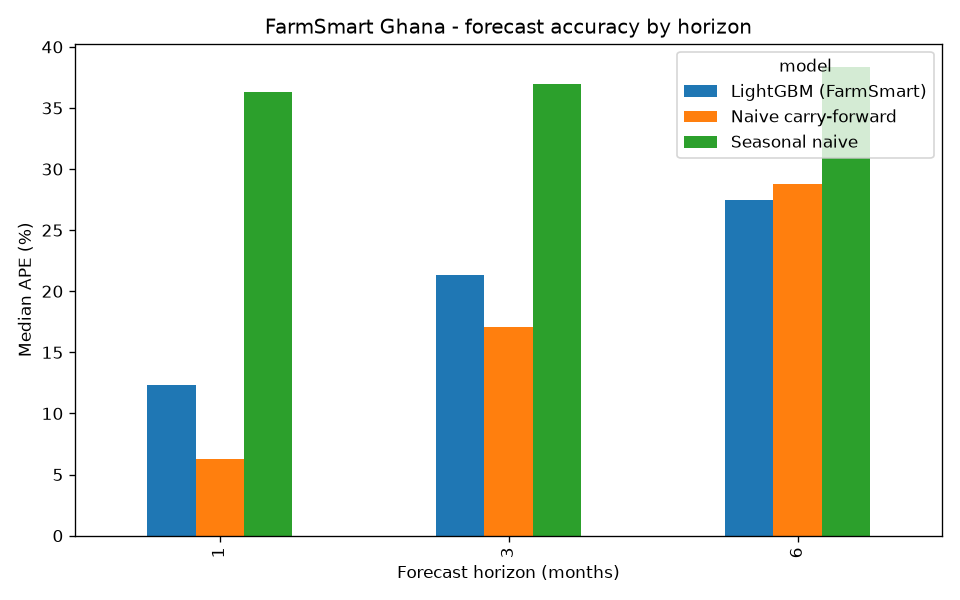

# FarmSmart Ghana

Crop **price intelligence and sell-timing advisory** for Ghanaian smallholder
farmers, built on real Ghanaian market data for the
[Ghana AI Innovation Challenge 2026](https://ghanaaisummit.com/research).

**Live demo:** https://farmsmart-ghana.streamlit.app/

Smallholders lose income two ways: they sell at the **wrong time** (dumping at
harvest when prices bottom) and in the **wrong market** (selling locally when a
nearby market pays far more). FarmSmart answers two questions in plain language
(and, in the full build, over USSD/SMS/WhatsApp in local languages):

- **When should I sell?** Seasonal forecasting of storable-staple prices.
- **Where should I sell?** Cross-market price-gap (arbitrage) detection.

## Primary Ghanaian dataset

World Food Programme **Ghana Food Prices**, published on the Humanitarian Data
Exchange (HDX): monthly retail/wholesale prices across Ghanaian markets, in GHS.
The pipeline downloads it automatically via the HDX CKAN API. See
[docs/DATA.md](docs/DATA.md) for full source disclosure and complementary sources
(MoFA SRID, GSS, FSNMS).

## Results so far (real backtest, fully reproducible)

Data after cleaning: **33,369** per-kg price records, **16 storable staples**,
**19 markets**, **2007-2023**. Backtest = strict time split, test on the last 18
months. Prices normalised to **GHS per kg**; perishables excluded (sell-timing
only helps crops a farmer can store).

Forecast accuracy by horizon (median APE, lower is better):

| Horizon | Naive (random walk) | FarmSmart (LightGBM) |
| --- | --- | --- |
| 1 month | **6.3%** | 12.3% |
| 3 months | **17.1%** | 21.3% |
| 6 months | 28.8% | **27.5%** |

Honest reading: at short horizons the random walk is a strong baseline (prices
are persistent). At the **6-month horizon - the one that matters for storage and
sell-timing decisions - FarmSmart beats both naive baselines on every error
metric** (MdAPE, MAPE, MAE, RMSE) and beats naive on 53% of individual forecasts.



Full metrics and the insight tables are in [results/](results/)
(`metrics.csv`, `insight_seasonal_swing.csv`, `insight_spatial_spread.csv`).

Structural findings (model-free, last 5 years):

- **Seasonal swing:** maize ~50%, rice ~49% within-year price movement - large,
  predictable, and capturable by storage.
- **Cross-market gap:** maize P90/P10 spread ~87% across markets in a given month
  - large, persistent arbitrage.

Example advisory (`python -m src.recommend --commodity Maize`): maize prices peak
around **May** and bottom around **September** (matching the main harvest);
storing across that window historically gains ~61%, and the dearest market pays
~135% more per kg than the cheapest.

## Quickstart

```bash
python -m venv .venv
# Windows:  .\.venv\Scripts\activate     macOS/Linux:  source .venv/bin/activate
pip install -r requirements.txt

python -m src.data         # download the WFP Ghana price data
python -m src.insights     # spatial + seasonal findings  -> results/
python -m src.forecast     # multi-horizon backtest        -> results/
python -m src.recommend --commodity Maize   # demo farmer advisory (CLI)
python -m src.predict      # forward 6-month price forecast (Maize)

streamlit run app.py       # interactive web demo (advice + forecast)
```

Live public demo: https://farmsmart-ghana.streamlit.app/

## Repository layout

```
src/data.py        Download + clean WFP data (normalise to GHS/kg, drop outliers)
src/features.py    Monthly aggregation, lag/return/seasonal features, targets
src/forecast.py    Naive + seasonal-naive + LightGBM backtest by horizon
src/insights.py    Cross-market spread and seasonal-swing analysis
src/recommend.py   Plain-language sell-where / sell-when advisory (CLI demo)
src/predict.py     Forward 6-month price forecast (per-horizon models)
app.py             Interactive Streamlit web demo (advice + forecast)
scripts/diagnose.py  Data-quality EDA
results/           Metrics CSVs and charts (generated)
docs/DATA.md       Data sources and disclosure
```

## Reproducibility

Deterministic seeds, a strict time-based split (no look-ahead: every predictor is
known at forecast time), and a one-command pipeline. Cleaning rules (per-kg
normalisation, 1st-99th percentile outlier clip per commodity) are in
`src/data.py`.

## Roadmap (full build for the Summit)

- Rolling-origin cross-validation across many origins for tighter accuracy bounds.
- Weather/rainfall and fuel-price covariates; production-estimate (MoFA) features.
- Local-language advisory assistant (Twi/Ewe/Dagbani) over USSD/SMS/WhatsApp.
- Per-farmer storage-cost-aware sell/hold recommendation.
